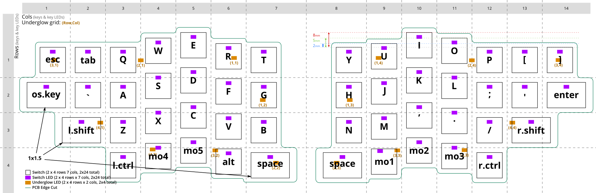
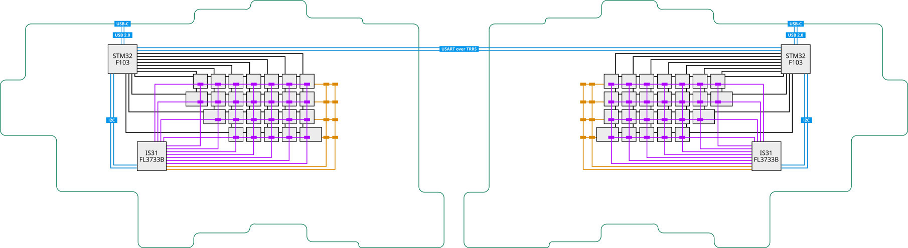

# 48 keys vertical-staggered split keyboard PCB design

Good day, experts!

Please take a look at this project description and please contribute if you want to work on this design of a PCB for a 48 keys vertical-staggered split keyboard.

### Licensing and terms

This work is published under [MIT](https://mit-license.org/) license at https://github.com/aynurin/NourK/. If you decide to contribute to this project, all your contributions will be covered by the same license.

### Project scope

This project requires a detailed finished PCB design in KiCad, based on the provided schematics, ready to be manufactured and assembled.

### Project description

Below is the layout of the keyboard:

The following is a diagram showing potential components of the PCB:

Key features of this keyboard PCB design:

1. minimal size to fit the layout, necessary components, and mounting holes
2. supports MX and Choc switches on the same PCB (including mix and match)
4. connects to the host device using USB-C on any side of the split keyboard
5. allows fitting into a full body case, or FR4 plates with standoffs (must include mounting holes)
6. supports QMK firmware

Please use only up-to-date, production grade RoHS-compliant SMD components of well-known manufaturers. Please indicate up-to-date stock with [Mouser](https://www.mouser.com/) and [LCSC](https://lcsc.com). For passive components, please use 0805 (imperial) or smaller size SMD components. Please make sure the PCB design conforms to [NextPCB](https://www.nextpcb.com/pcb-capabilities) capabilities, or let me know otherwise. Please let me know if your design requires more than 1 layer on each side of the PCB.
